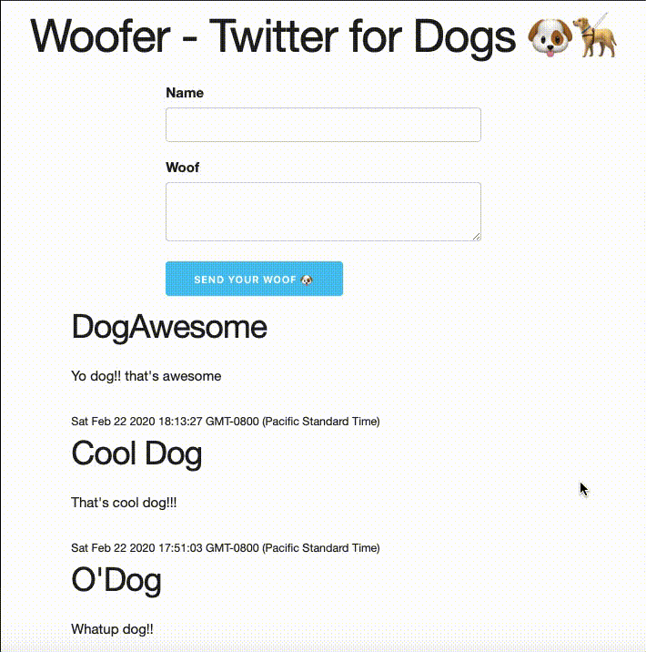

# Woofer - Twitter for Dogs 🐶

A basic twitter clone built to demonstrate the full stack (client, server, database).

With the follwing features:
* Dogs can send a woof
* Dogs can see all woofs that have been sent



## To run client
```bash
cd client
live-server
```

## To run server
```bash
cd server
npm run dev
```